  

  

  

Sou estudante de **Ciência e Tecnologia na Universidade Federal do ABC
(UFABC)** e curso **Desenvolvimento de Sistemas no SENAI Paulo Antonio
Skaff**. Também tenho como base o **Ensino Médio Técnico em Eletrônica**,
cursado na ETEC José Rocha Mendes.

Estou em formação, construindo minha base em **desenvolvimento web** e
**fundamentos de computação**, unindo a formação acadêmica da UFABC
(programação, lógica, algoritmos, teoria dos grafos e redes) com a
formação técnica do SENAI (front-end, back-end, bancos de dados e
arquitetura de aplicações).

Tenho interesse em **desenvolvimento web** e **arquitetura de sistemas**,
buscando aplicar esses conhecimentos em projetos e continuar ampliando
minha formação em tecnologia.

 

  

  

<table width="100%">
<tr>
<td width="25%" valign="middle">
<b>Front-end</b>
</td>
<td width="100%" valign="middle">

</td>
</tr>

<tr>
<td width="22%" valign="middle">
<b>Back-end</b>
</td>
<td width="78%" valign="middle">

</td>
</tr>

<tr>
<td width="22%" valign="middle">
<b>Mobile</b>
</td>
<td width="78%" valign="middle">

</td>
</tr>

<tr>
<td width="22%" valign="middle">
<b>Web / MVC</b>
</td>
<td width="78%" valign="middle">

</td>
</tr>

<tr>
<td width="22%" valign="middle">
<b>Banco de Dados</b>
</td>
<td width="78%" valign="middle">

 
<code>DDL</code> · <code>DML</code> · <code>DQL</code>
</td>
</tr>
</table>

  

  

  

<h3>⚙️  Arquitetura & Boas Práticas</h3>

Conceitos e práticas estudados principalmente no curso técnico do <b>SENAI</b>:

<ul>
  <li>Programação Orientada a Objetos (OOP)</li>
  <li>SOLID</li>
  <li>Design Patterns</li>
  <li>MVC</li>
  <li>Clean Architecture</li>
  <li>Domain-Driven Design (DDD)</li>
  <li>REST APIs</li>
</ul>

  

<h3>🧠 Fundamentos de Computação</h1>

Base construída principalmente através das disciplinas da **UFABC**:

<table width="100%">
<tr>
<th width="30%">Disciplina</th>
<th width="20%">Linguagem / Foco</th>
<th width="50%">Conteúdo</th>
</tr>
<tr>
<td><b>Bases Computacionais da Ciência</b></td>
<td>Python</td>
<td>Introdução à programação e fundamentos de lógica</td>
</tr>
<tr>
<td><b>Processamento da Informação</b></td>
<td>Java</td>
<td>Pensamento lógico, programação e algoritmos</td>
</tr>
<tr>
<td><b>Comunicação e Redes</b></td>
<td>Portugol</td>
<td>Fundamentos de redes, teoria dos grafos, algoritmos em grafos e algoritmo de Dijkstra</td>
</tr>
</table>

 

**Linguagens estudadas na formação:**  
`Python` · `Java` · `Portugol`

  
<h3>🧰 Ferramentas e Metodologias</h3>

<b>Desenvolvimento</b>

 

<b>Design e Organização</b>

 

<b>Gestão de Projetos</b>

 

<b>Metodologias</b>

 

 
<code>Sprints</code>

<b>Design Thinking</b>

 

`Empatizar` → `Definir` → `Idealizar` → `Prototipar` → `Testar`
  

<code>Brainstorming</code> ·
<code>Wireframing</code> ·
<code>Prototipação</code>

<b>Hardware</b>

 

  

  

### 🏛️ Universidade Federal do ABC — UFABC 
**Bacharelado em Ciência e Tecnologia**

 `Jun 2025 – Atual`
 
Formação acadêmica com base em computação, programação, matemática,
ciência e tecnologia.

**Conteúdos relacionados:**
- Bases Computacionais da Ciência — Python
- Processamento da Informação — Java
- Comunicação e Redes — Portugol - Teoria dos Grafos - Algoritmo de Dijkstra

 

### 🛠️ SENAI Paulo Antonio Skaf
**Técnico em Desenvolvimento de Sistemas**

`Jan 2025 – Dez 2026`

Formação técnica com foco em **desenvolvimento web**, abrangendo
front-end, back-end, mobile, bancos de dados e fundamentos de
arquitetura de aplicações.

**Principais tecnologias estudadas:**
`C` · `C#` · `HTML` · `CSS` · `JavaScript` · `TypeScript` · `React` ·
`Next.js` · `Node.js` · `React Native` · `.NET` · `ASP.NET Core` ·
`SQL Server`

 

### ⚡ ETEC José Rocha Mendes
**Ensino Médio Integrado ao Técnico em Eletrônica** 

`Jan 2022 – Dez 2024`

Formação técnica integrada ao Ensino Médio, com base em eletrônica.

  
  

  

Estou estruturando meu portfólio de projetos e planejando uma
**landing page própria** para apresentar as aplicações desenvolvidas
ao longo da minha formação.

Esta seção será atualizada conforme novos projetos forem concluídos. 🚧

<!--
### Projeto 01 — Nome do Projeto
> Descrição objetiva do problema e da solução desenvolvida.

**Stack:**
`C#` · `ASP.NET Core` · `Entity Framework Core` · `SQL Server`

**Principais implementações:**
- Desenvolvimento da API
- Modelagem de dados
- Implementação das regras de negócio

[Ver projeto →](LINK_DO_REPOSITORIO)
-->

  

  

  

  
  
  
  
  

  
  

  

Mariana Cordeiro · Ciência e Tecnologia · Desenvolvimento Web

